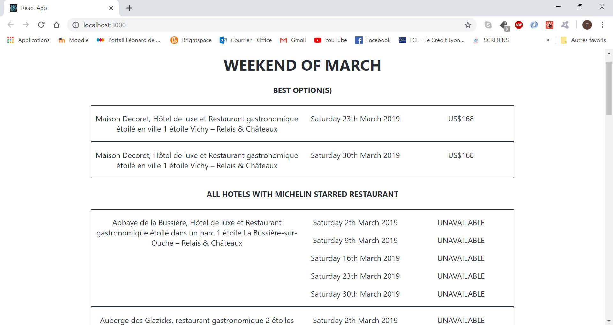

# Web-Application :computer: Final-Report :memo:
Create a Web App using NodeJS & React : List the best rates - for each Weekend - for France located Relais &amp; Châteaux with starred restaurants

## Scrap the web with nodeJS and Cheerio

- **1st step** : Scrap Michelin website to get names of all starred restaurants : *scrapingMichelin.js* => *restaurants.json*
- **2nd step** : Scrap Relais & Château website to get the url of each Relais & Chateau hostel in France *scraping() relais.js* => *urls_hotels.json*
- **3rd step** : Compare name of restaurant in *restaurants.json* with name of restaurant in each url of Relais & Chateau website and define if the restaurant of this hotel is a starred restaurant.
(PB: It is harder than expected to match names of the restaurants from the differents website because they can vary a bit)

> **Change of strategy :** 

#### SCRAPING ON RELAIS&CHATEAUX (NodeJS)

- **3rd step** : Scrap each url for every Relais & Chateau hostel in France to get the full name-description of the hostel and know if it includes a starred restaurant (exemple: "Maison Decoret, Hôtel de luxe et Restaurant gastronomique étoilé en ville **1 étoile** Vichy – Relais & Châteaux" ): *isStars() relais.js*

- **4th step** : Fetch the prices of each weekend of March for every hostels with starred restaurant : *getPrice() relais.js*
>**TO DO THAT**

- **5th step** : We need to fetch a request for each hotel: "https://www.relaischateaux.com/fr/popin/availability/check?month=2019-3&idEntity=22926"%7C%7CSTD&pax=2&room=1" and to change from one hotel to another we need to change the *'idEntity'* specific to each hostel. To get them, we create the *getidEntity()* function that return the idEntity of each hostel.

- **6th step** : Find the best price for each weekend of March 2019 : *getBest() relais.js* 

- **7th step** : Fetch the important information of the best price : name of the hostel, date of availability and price.

All in all, we use the JSON file containing the 12 Relais & Châteaux hostel with a starred restaurant, their prices for each weekend of March (the Saturday night) and their availability.

PS: To get all prices of March for every hostel in real time, *getPrice()* must be called before starting the app or be called continuously. That way, we could have displayed the most accurate and up-to-date list. But this *getPrice()* function takes around 10 min to generate the *March_WE.json* file. In order to avoid losing time while bulding the app, we ran the function once and used the json file created the 15th February 2019.

 
## Build a Web App with ReactJS and create-react-app 

- **1ère étape**: Création de l'application et de l'environnement de développement
- **2ème étape**: Utilisation des fonctions clé et importation des json générés précédemment
- **3ème étape**: Design en html/css de la page web de l'application

## FINAL RESULT :

- We scrap all prices for each hostels with a stared restaurant for every weekend of March.
- We store the results into a json file called *March_WE.json*.
- We print the results into tabs threw a web application where we can find the best rate for March 2019 and a summary of all hostels with stared restaurant and their price for the weekends of March.

